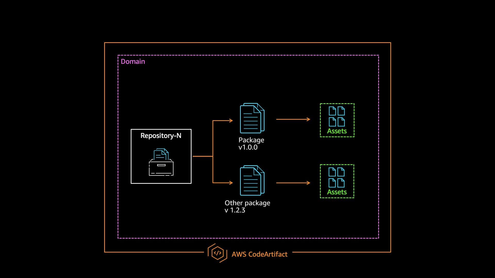

## What is AWS CodeArtifact?
[AWS CodeArtifact](
https://docs.aws.amazon.com/codeartifact/latest/ug/welcome.html) is a fully managed artifact repository service that makes it easy for organizations to securely store and share software packages used for application development. You can use CodeArtifact with popular build tools and package managers such as **Maven**, **Gradle**, **npm**, **yarn**, **pip**, and **twine**. 

AWS CodeArtifact automatically scales when you ingest or publish new packages to your repositories. Because it's a fully managed service, the setup and operation of its infrastructure is done for you.

## Sections

### [Getting Started](/getting-started)

Samples across various programming languages that step through deploying a AWS CloudFormation template and then configuring CLI tools (npm, pip, nugent, maven, etc).

- [dotnet](/getting-started/dotnet)
- [node](/getting-started/node)

Each sample utilizes AWS CloudFormation and the AWS CLI to:

- Provision 1 domain and 2 repositories (internal, external) via [AWS CLoudFormation](https://docs.aws.amazon.com/AWSCloudFormation/latest/UserGuide/Welcome.html)
- Integrate with an [upstream repository](https://docs.aws.amazon.com/codeartifact/latest/ug/repos-upstream.html)
- Integrate with a public [external connection](https://docs.aws.amazon.com/codeartifact/latest/ug/external-connection.html)
- Configure package manager via CLI(s) to utilize the repositories

## Security

See [CONTRIBUTING](CONTRIBUTING.md#security-issue-notifications) for more information.

## License

This library is licensed under the MIT-0 License. See the LICENSE file.

