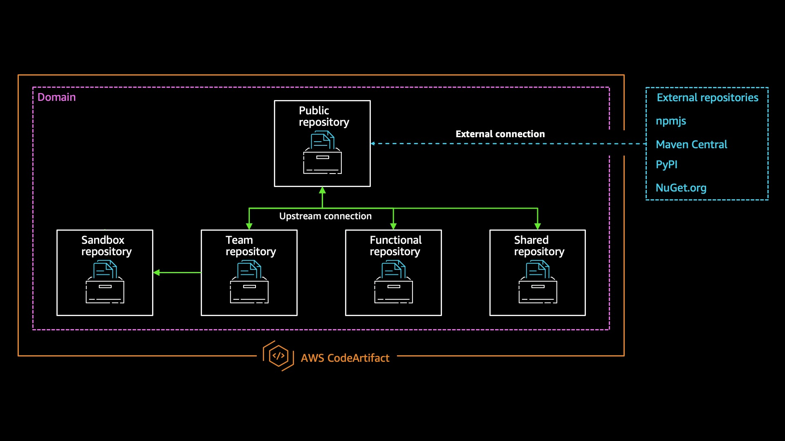

## Steps

1. Go to `cloudformation` directory

    ```
    cd cloudformation/
    ```

2. Deploy stack using AWS CLI

    ```
    aws cloudformation deploy \
    --stack-name aws-codeartifact-samples \
    --template-file deploy.yml \
    --no-fail-on-empty-changeset \
    --region us-west-2
    ```

3. Describe stack using AWS CLI

    ```
    aws cloudformation describe-stacks \
    --stack-name aws-codeartifact-samples \
    --region us-west-2
    ```

4. Go to `sample` directory

    ```
    cd ../sample
    ```
5. Login to AWS CodeArtifact

    ```
    aws codeartifact login --tool npm --repository my-team-repository --domain example-domain --domain-owner <<ACCOUNT_ID>>
    ```

6. Install the required NPM modules

    ```
    npm i
    ```

7. Build the library
    ```
    npm run build:prod
    ```

8. Login and publish the library to AWS CodeArtifact
    ```
    npm login
    npm publish
    ```


